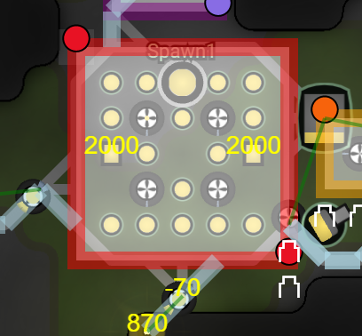
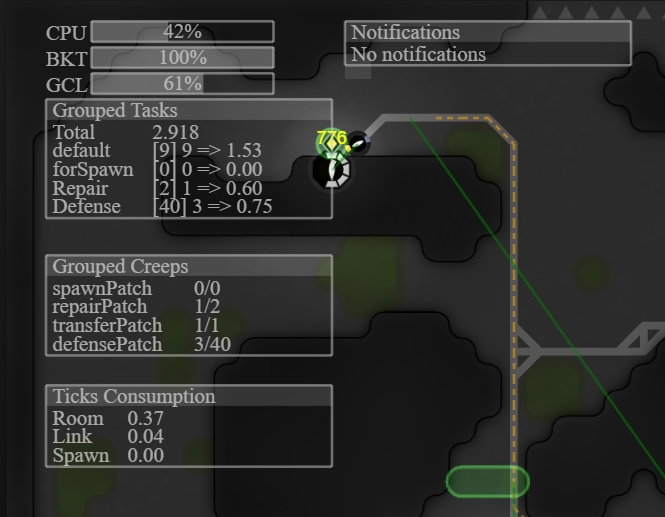
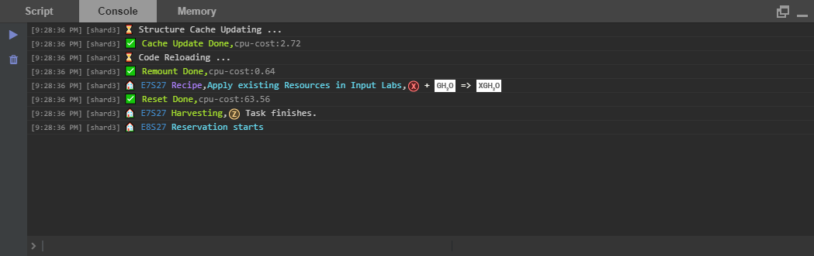

# Screeps-Lucy

`Lucy` is my 3rd version AI for [screeps](https://screeps.com), which is an MMO strategy game for programmers. Inspired from many others' marvelous works, I decide to write a fully-automatic AI, which targets at earning credits.
## Features
### Room Level
- Automatic Plan
    - Unit-based, which allows for flexibility.
    - Run at every tick for some cases, while employing caching to speed up.
    - Use `minCut` written by @saruss to construct ramparts to protect important units.
- Automatic Claim
    - Triggered whenever `GCL` is upgraded.
    - Filter out rooms unfit for the `Automatic Plan` pattern.
    - Filter out rooms the path to which inevitably contain hostile rooms.
- Automatic Remote Mining (Source and Mineral)
    - Beta Version, still suffering from edge cases and unable to protect itself well.
### In-Room Level
- Market
    - Buying and Sending based on demand.
    - Selling is triggered automatically and based on demand of credits and relies on settings.
- Lab
    - Choose the produced resource based on some principles and possessed resources.
    - Trigger `buying`, if some ingredients are needed automatically.
- Central Spawn Unit
    - Imitate the layout of @tigga.

    

- Central Transfer Unit
    - Enable flexible and fast transferring of Resources
### Behind the Scene
- Task System
    - Allow for Function or in-built `Task Module` to create high-performance, clear and easy-to-program `run` function.
    - Event-Trigger, which is used to avoid attempt of issuing all possible tasks at every tick.
    - Seamless Succession, which is natively implemented.
    - Pre-reject Task if `ticksToLive` is not enough and seemly Recycle.
    - Trigger spawning Creeps whose bodies are dynamically determined based on demand.
- Money System
    - Provide standards to evaluate `Task` and, thus, choose the most profitable one.
- Flag System
    - Used for trigger.
- Global Manager
    - Spawn of Creep, implementing `GroupPatch Constraint`.
    - Task, implementing `GroupPatch Constraint`.
    - Resource, comprised of `retrieve` and `store`, implementing `Resource Reserve`.
    - Link, implementing `Source Destination Mechanisms` and `Trigger-Driven Response`.
- *Structure Memory* (removed)
    - Periodical or Computation-oriented Recycle.
### Script & Visual
- Visualizer & Notifier
    - Adapted from `Overmind` written by @bencbartlett.
    - Extend with monitoring any `variable`.

    

- Pretty Console Log
    - Adapted from `ScreepsAI` written by @canisminor1990.

    

### Others
- Enhanced `Traveler`
    - Add support for option `flee`.
    - Add support for `byPass` which focuses on utilizing positions occupied by idle creeps.